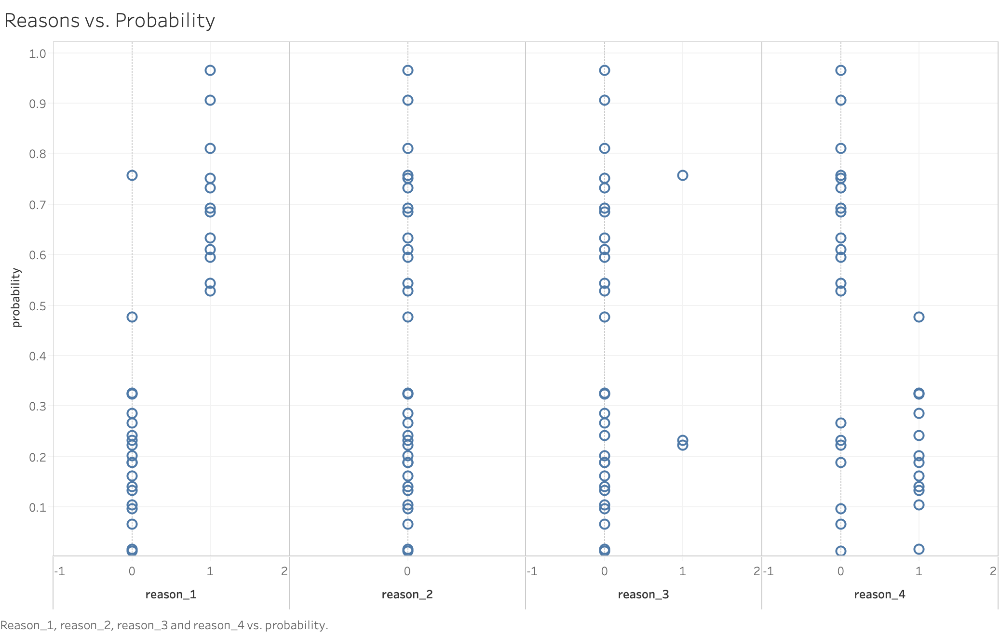

# absenteeism-regression
Taken under 365 Data Science Program's SQL/Python/Tableau course

**Data source:** https://archive.ics.uci.edu/ml/datasets/Absenteeism+at+work

# Problem
Excessive absenteeism is a major problem in the workplace. In Canada alone, 8.1% of employees were absent at least once a week for personal reasons (excluding maternity leave), a 1.1% increase since 10 years ago (Statistics Canada, 2011). Absenteeism is detrimental to businesses, as it disrupts proper work schedule and output. In this case study, using the specific factors listed below as inputs, I hoped to create a logistic regression model predicting whether an individual was going to be excessively absent. Ultimately, this model achieved a 73.5% accuracy from test data.

The following were the factors in the study:
<pre><code>3. Month of absence 
4. Day of the week (Monday (2), Tuesday (3), Wednesday (4), Thursday (5), Friday (6)) 
5. Seasons (summer (1), autumn (2), winter (3), spring (4)) 
6. Transportation expense 
7. Distance from Residence to Work (kilometers) 
8. Service time 
9. Age 
10. Work load Average/day 
11. Hit target 
12. Disciplinary failure (yes=1; no=0) 
13. Education (high school (1), graduate (2), postgraduate (3), master and doctor (4)) 
14. Son (number of children) 
15. Social drinker (yes=1; no=0) 
16. Social smoker (yes=1; no=0) 
17. Pet (number of pet) 
18. Weight 
19. Height 
20. Body mass index 
21. Absenteeism time in hours (target) 
</code></pre>

As stated by the original data source (2.), the following were the twenty one reasons given by employees on why they were absent on certain dates:
<pre><code>I Certain infectious and parasitic diseases
II Neoplasms 
III Diseases of the blood and blood-forming organs and certain disorders involving the immune mechanism 
IV Endocrine, nutritional and metabolic diseases 
V Mental and behavioural disorders 
VI Diseases of the nervous system 
VII Diseases of the eye and adnexa 
VIII Diseases of the ear and mastoid process 
IX Diseases of the circulatory system 
X Diseases of the respiratory system 
XI Diseases of the digestive system 
XII Diseases of the skin and subcutaneous tissue 
XIII Diseases of the musculoskeletal system and connective tissue 
XIV Diseases of the genitourinary system 
XV Pregnancy, childbirth and the puerperium 
XVI Certain conditions originating in the perinatal period 
XVII Congenital malformations, deformations and chromosomal abnormalities 
XVIII Symptoms, signs and abnormal clinical and laboratory findings, not elsewhere classified 
XIX Injury, poisoning and certain other consequences of external causes 
XX External causes of morbidity and mortality 
XXI Factors influencing health status and contact with health services. </code></pre>
For more information about the reasons and the factors of the dataset, feel free to visit the datasource link show above.

The model was then pickled and uploaded onto a MySQL database and the data was also used to create preliminary data visualizations using Tableau. The data visualizations are available in the `assets` folder. A preliminary data visualization such as the one below analyzes the probability of one being absent for work with 0 representing less than excessive and 1 being excessive. The metholodogy more specifically is specified in the `preprocessing_absenteeism.ipynb` and `logistic_abseentism.ipynb` files.

In the dataset, it is interesting to notice that category 2 reasons such as pregnancy was not likely for the person to be excessively absent, while category 1 reasons relating to illness was most likely to cause absenteeism.

## Other files
* `.sql` files were used to structure the database
* `deployment_to_sql.ipynb` file was used to create a reusable module featuring the model and connecting the model with the SQL server.
* `.twb` files are Tableau Workbooks
* `data` files contain original data sources with `absenteeism.csv` being the original data source training and testing data and `df_preprocessed.csv` being the data source used to test the model module.

## What I Learned:
* Step by step process from processing to building a model to creating presentable data visualizations, leading to data insights
* Connecting Python to MySQL
* Pickling and creating reusable modules using the model
* Integrating multiple technologies in one project.

# Works Cited List:
Statistics Canada. (2011). Work absences in 2011. Retrieved from https://www150.statcan.gc.ca/n1/pub/71-211-x/2012000/part-partie1-eng.ht
